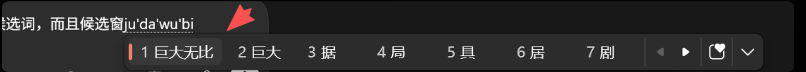

# AGENTS.md — shurufa233

This file is the **product constitution** for humans and coding agents.
If any README, design note, commit message, or Rime-related code comment conflicts with this document, **this document wins**.

---

## 1. One-line product goal

**Build a production-grade local Chinese IME whose daily typing experience matches WeChat Input Method and Windows Chinese Input Method (Microsoft Pinyin), not Rime / Weasel / Rime Ice.**

Rime Ice is a **dictionary and migration source**, not the product bar.

---

## 2. North-star references (in priority order)

| Priority | Reference | What we copy | What we do **not** copy |
| ---: | --- | --- | --- |
| **P0** | **微信输入法** | Typing rhythm, candidate ranking feel, light Shift 中/英, `;` / `'` quick select, horizontal strip comfort, continuous association after commit, emoji-friendly candidates | WeChat cloud sync, ads, account lock-in, server-side suggestion pipeline as a requirement |
| **P0** | **Windows 中文输入法 / Microsoft Pinyin** | System coexistence, two-line preedit+candidates (or Win11 compact strip), caret-anchored window, punctuation-first-commit-then-insert, page keys, Ctrl+Shift with other TIPs, password/terminal English-safe behavior | Forcing itself as the OS default IME, Input Experience residue, cloud-only features |
| **P1** | Sogou / QQ Pinyin (only if needed) | Mature edge cases (long sentence, mixed CN/EN, number selection) when WeChat/MS docs are silent | Skin kits, marketplace, adware patterns |
| **P2** | Rime / Weasel / Squirrel / **Rime Ice** | **Word lists**, `custom_phrase`, `userdb`, `custom.yaml` migration, optional power-user schemas | Default UX, default key profile, default layout, “Rime-like is good enough” product decisions |

### Explicit anti-goal

- **Do not** optimize the default path toward “more Rime-compatible”.
- **Do not** treat “we imported rime-ice dict successfully” as product success.
- **Do not** ship defaults that feel like Weasel/Rime Ice (vertical lists, comment-heavy strips, comma/period paging, missing `;`/`'` quick select) unless the user **explicitly** selects a Rime schema/profile.

Default shipped experience must feel like:

```text
wechat-pinyin + keyProfile=wechat + candidateLayout=horizontal
+ candidateWindowMode=win11 (or full Microsoft-style two-line when mode=full)
+ Shift light-tap 中/英 + coexistence with Microsoft IME
```

---

## 3. Production experience bar (Definition of Done)

A change is **not done** until it improves or at least preserves all P0 items below on **Windows 11**.

### 3.1 Feel (WeChat-class)

1. **First-key latency**: key → preedit/candidate visible must feel instant under normal desktop load. Prefer in-process Go core hot path; never block TSF key handling on daemon HTTP.
2. **Continuous typing**: space commits preferred candidate; next pinyin starts cleanly with no ghost composition or stuck strip.
3. **Quick select**: with `keyProfile=wechat` / `microsoft`, `;` and `'` select 2nd/3rd candidate (except when Microsoft double-pinyin legitimately consumes `;` as `ing`).
4. **Shift 中/英**: light Shift toggles mode; Ctrl/Alt combos pass through to Windows/apps unless user-bound.
5. **Associations**: after commit, show useful follow-up candidates; new pinyin replaces them; punctuation dismisses them then inserts.
6. **Mixed input**: URL/email/uppercase recognizer keeps literal buffers; Chinese punctuation does not corrupt them.
7. **Emoji / symbols**: common emoji and symbol candidates stay readable (emoji font path); no layout jump that looks broken next to pure Chinese rows.
8. **Learning**: pin/hide/user scores must change future ranking without requiring restart.

### 3.2 System behavior (Microsoft-class)

1. **Never steal default IME** on install. Coexist with Microsoft Pinyin via normal language bar / `Ctrl+Shift`.
2. **Candidate window** anchors to caret, stays `TOPMOST` without activating, fits work area, supports DPI scaling.
3. **Hide Windows 输入体验 residue** when our strip shows (no double candidate UI).
4. **Two-line mental model** when not in compact win11 mode:
   - upper: preedit (pinyin/English spelling as typed, including `xi'an` separators)
   - lower: Chinese candidates
5. **Win11 compact mode** (`candidateWindowMode=win11`): single calm horizontal strip, Microsoft-like density; still correct selection/paging.
6. **Paging**: `[` `]` / `-` `=` / PageUp/PageDown / mouse wheel aligned with config; WeChat default does **not** use `,` `.` for paging.
7. **Numbers 1–9 / numpad**: select visible page candidates; space/enter commit.
8. **Punctuation**: commit selected (or raw buffer) first, then insert full/half punctuation; paired `“”` `‘’` alternate.
9. **App rules**: password fields, terminals, games prefer English / half-width / no noisy candidates.
10. **x64 / x86 / arm64** Windows 11 first production line; no “works only on my x64 box” merges.

### 3.3 Privacy & product stance

- Local-first, **no telemetry**, **no ads**, **no account requirement**.
- No mandatory company-cloud suggestion pipeline.
- Optional agent/AI features are opt-in, never block offline Chinese input.
- Dictionary updates may use GitHub/mirrors; user learning data never auto-uploads.

### 3.4 Visual / interaction targets (ground truth)

**Landed P0 reference (Windows 中文输入法):**



Source file: [`docs/targets/ms-pinyin-target.png`](docs/targets/ms-pinyin-target.png)  
Index: [`docs/targets/README.md`](docs/targets/README.md)

This screenshot is the **production visual bar** for composition chrome. Rime Ice demos are not.

#### What the target encodes (must implement / preserve)

| Layer | Required behavior |
| --- | --- |
| **Inline preedit** | Show exact typed spelling in/near the caret, including syllable separators (`ju'da'wu'bi`). Keep a light underline / dotted underline on the composing segment. |
| **Floating strip** | Caret-anchored horizontal bar under preedit; dark/system-friendly surface, rounded corners, soft shadow, `TOPMOST` without activation. |
| **Candidates** | ~7 per page, numbered `1..n`, Chinese text primary; selected item has **left vertical accent bar** + rounded pill highlight. |
| **Density** | Single compact horizontal row (Microsoft / WeChat), not a tall vertical Rime list. |
| **Trailing chrome** | Page prev/next controls; optional utility icons (settings / more) without cluttering the candidate text. |
| **Comments** | Not shown as heavy second-line annotations by default; engine may still carry comment data for power modes. |
| **Separators** | Apostrophe-forced syllables must appear in preedit exactly as typed and drive segmentation (e.g. `xi'an` → 西安 path). |

#### Product surfaces vs target

| Surface | Target look & behavior |
| --- | --- |
| Default candidate strip | Match `ms-pinyin-target.png` silhouette; `candidateLayout=horizontal`, page size ~7, Microsoft YaHei UI family |
| `candidateWindowMode=win11` | Compact density aligned with Win11 Microsoft strip |
| `candidateWindowMode=full` | Explicit two-line preedit + candidate band when more chrome is needed |
| Skin presets | `microsoft-light` / `wechat-clean` / `wechat-dark` first-class; dark strip parity with target is required for night/system dark |
| `rime-vertical` | Power-user only — never default |
| Context menu | Commit / pin / hide / first-char / last-char |
| Settings | Fast, local, Chinese-friendly; schema default `wechat-pinyin` |

#### Still open

- `docs/targets/wechat-strip.png` — companion P0 for WeChat typing rhythm (optional until provided)
- `docs/targets/shurufa-target.png` — side-by-side self-check of our strip vs the bar above

Until WeChat capture lands, live 微信输入法 remains the feel reference; Microsoft strip above remains the **visual geometry** reference.

---

## 4. Architecture agents must preserve

```text
core/engine   Pure Go: buffer, segment, rank, learn, schemas, keys, skins
core/abi      C ABI for native glue (hot path + JSON command bus)
cmd/daemon    Local HTTP IPC, config, dict updates, settings host
cmd/imecli    Deterministic CLI for engine behavior & regressions
apps/settings Vite/React settings (future Wails host)
native/windows/tsf   Thin TSF glue + candidate window paint/input
native/macos/imkit   Future thin glue (same ABI)
```

### Hard rules

1. **Business logic lives in Go.** TSF/C++ stays thin: keys, composition, window paint, commit text, load ABI.
2. **One shared config** (`%APPDATA%\shurufa233\config.json` / `SHURUFA233_CONFIG`). TSF, daemon, CLI, settings must not diverge on fuzzy, layout, keys, punctuation, script.
3. **Hot path stays in-process** (`ShurufaInputKeyFast`, candidate payload APIs). Daemon HTTP is fallback/management, not per-key critical path.
4. **Forward-compatible command bus** (`ShurufaExecuteCommand` / `candidate-action` / `key-event-json`) for new features before new C++ exports.
5. **Rime import is an adapter**, not a runtime dependency. Convert into shurufa233 JSON/scores/phrases/config; do not embed Rime engine.
6. **Do not grow platform-specific ranking** in C++. Ranking, separator segmentation, associations, emoji kinds belong in `core/engine`.

---

## 5. Defaults that define the product

These defaults are part of the contract. Changing them needs an explicit product reason, not “closer to Rime”.

| Field | Production default | Meaning |
| --- | --- | --- |
| `schema` | `wechat-pinyin` | WeChat/Microsoft full pinyin daily scheme |
| `keyProfile` | `wechat` | `;`/`'` quick select; no comma/period paging |
| `candidateLayout` | `horizontal` | WeChat/MS strip |
| `candidateWindowMode` | `win11` | Compact system-like strip |
| `candidatePageSize` | `7` | clamp 3..9 |
| `shiftToggleMode` | `true` | light Shift 中/英 |
| `punctuation` | `full` | Chinese punctuation in zh mode |
| `associations` | `true` | post-commit continuity |
| `language` / `mode` | `zh-CN` / `zh` | Chinese-first |
| `script` | `simplified` | simplified output |
| Installer default TIP | **do not** become OS default | coexist with Microsoft IME |

Rime Ice schema (`rime-ice-pinyin`) may remain available for power users and dictionary pipelines. It must never become the silent default.

---

## 6. Feature priority ladder

When trade-offs appear, implement in this order:

1. **Correct commit & no stuck state** (composition lifecycle, focus, residue)
2. **Latency & stability** (no hang, no double UI, no focus steal)
3. **WeChat/MS key semantics** (Shift, space, numbers, `;` `'`, paging, punctuation)
4. **Ranking quality** on common daily phrases (not rare classical dictionary flex)
5. **Learning** (pin/hide/scores) that sticks across sessions
6. **Dictionary coverage** (including Rime Ice bulk import as supply chain)
7. **Skins / comments / vertical / Rime power features**
8. **Agent/AI / cloud sync extras**

Never reverse this ladder for “more Rime features”.

---

## 7. Rime Ice — allowed uses only

Allowed:

- Import/sync large dictionaries (`dictimport` / `dictsync` / manifests)
- Migrate `custom_phrase.txt`, `*.userdb.txt`, `*.custom.yaml`
- Optional schema `rime-ice-pinyin` and symbol prefixes for users who want them
- Tests that prove converters do not lose entries

Not allowed as product justification:

- Changing default layout/key profile “to match Ice”
- Making comments, vertical list, or Rime paging the default
- Measuring success only by Ice feature parity matrix
- Porting Weasel UI chrome as the primary Windows candidate window

**Phrase for agents:** *Rime Ice feeds the dictionary; WeChat and Microsoft Pinyin define the product.*

---

## 8. Engineering workflow for agents

### Before coding

1. Restate the user-visible WeChat/MS behavior you are protecting or improving.
2. Identify layer: `engine` / `abi` / `daemon` / `tsf` / `settings`. Prefer engine+tests first.
3. Check whether a Rime-shaped request is actually a **migration** task vs a **default UX** change. If UX, re-target to WeChat/MS.

### While coding

1. Keep changes scoped; no drive-by refactors.
2. Add/adjust Go tests for ranking, keys, associations, separators, config normalization.
3. For TSF-visible behavior, update `docs/windows.md` only when user-facing install/runtime contract changes; keep this `AGENTS.md` as the north star.
4. Preserve ABI compatibility; add optional exports / command-bus verbs instead of breaking hot-path signatures.
5. Never force-push, never skip hooks, never commit secrets.

### Verification (minimum)

```powershell
go test ./...
go test ./core/engine -count=1
go run ./cmd/imecli candidates nihao
go run ./cmd/imecli candidates nihao select --display-index 1
```

For native Windows work (when build tools present):

```powershell
powershell -ExecutionPolicy Bypass -File .\scripts\build-windows.ps1
# install only with user intent; prefer SmokeEdit F5/F6 validation
```

Manual A/B when touching input feel:

1. Type the same phrase in **Microsoft Pinyin**, **WeChat IME**, and **shurufa233**.
2. Compare: first candidate quality, page keys, Shift, punctuation after candidate, strip position, double-UI absence.
3. If shurufa233 feels more like Rime than WeChat/MS, the change is not production-ready.

### Commit / PR expectations

- Explain **user-visible IME impact** in WeChat/MS terms.
- Mention latency, coexistence, and default-schema safety when relevant.
- Do not celebrate Rime parity unless the ticket is explicitly migration/dict.

---

## 9. Acceptance checklist (production gate)

Copy into PR descriptions for user-facing IME changes:

- [ ] Default schema/key/layout still WeChat/MS oriented
- [ ] No install path steals OS default IME
- [ ] Hot path does not require daemon HTTP
- [ ] Composition cannot get permanently stuck; Escape/clear paths exist
- [ ] Candidate window: caret anchor, DPI, no activate, no MS residue double UI
- [ ] Visual geometry checked against `docs/targets/ms-pinyin-target.png` (preedit separators, horizontal strip, selected accent pill, paging chrome)
- [ ] Space / numbers / `;` `'` / paging / Shift match `keyProfile` defaults
- [ ] Punctuation commits candidate then inserts mark
- [ ] Associations work without breaking next pinyin
- [ ] Pin/hide/learn persist and affect rank
- [ ] `go test ./...` passes
- [ ] Side-by-side feel check vs WeChat IME and Microsoft Pinyin done (or explicitly N/A with reason)

---

## 10. Non-goals (current production line)

- Becoming a full Rime distribution or Weasel skin marketplace
- macOS/iOS/Android parity before Windows 11 production quality
- Cloud IME account system
- Replacing Windows language pack infrastructure
- Perfect classical/rare character coverage before daily chat/coding comfort
- AI rewriting as a dependency of basic pinyin input

---

## 11. Vocabulary (avoid product confusion)

| Term | Meaning here |
| --- | --- |
| **Product bar** | WeChat IME + Windows Microsoft Pinyin experience |
| **Compatibility bar** | Rime/Ice/Luna import & optional schemas |
| **Hot path** | Per-key TSF → Go core → candidate/commit |
| **Management path** | Daemon HTTP, settings UI, dict update, profile sync |
| **Production** | Windows 11, three-arch install, privacy, latency, coexistence, default WeChat/MS feel |

---

## 12. Final reminder

Every agent decision should answer:

> “Does a daily user coming from **微信输入法** or **Windows 自带中文输入法** feel at home in the first 30 seconds?”

If the answer is no, the work is not done — regardless of how complete Rime Ice import looks.
